```{r setup, include = FALSE,  eval = TRUE}
main_dir <-  '..'
common_img_dir <- file.path(main_dir,'courses_tools','resources', 'common_figs')
course_img_dir <- file.path(main_dir,'resources', 'figs')
BibOptions(check.entries = FALSE,
           bib.style = "authoryear",
           cite.style = "alphabetic",
           style = "markdown",
           hyperlink = FALSE,
           dashed = FALSE)
myBib <- ReadBib('bibliography.bib', check = FALSE)
with_sol <- TRUE ## in order to control the output
with_course <- TRUE
```


name: motiv
# Motivations

---
template: motiv

## La recherche reproductible


 Dans leur [papier](../resources/bes2.1801.pdf) `r Citet(myBib,'alston2021beginner')` font le point sur la question de la recherche reproductible en écologie.
 
 
 Ils identifient des  [Points clé](../resources/bes2.1801_crop.pdf)


Les journaux scientifiques exigent de plus en plus de reproductibilité.

--

## En pratique

Quelle est la bonne version du rapport ?

.centerimg[
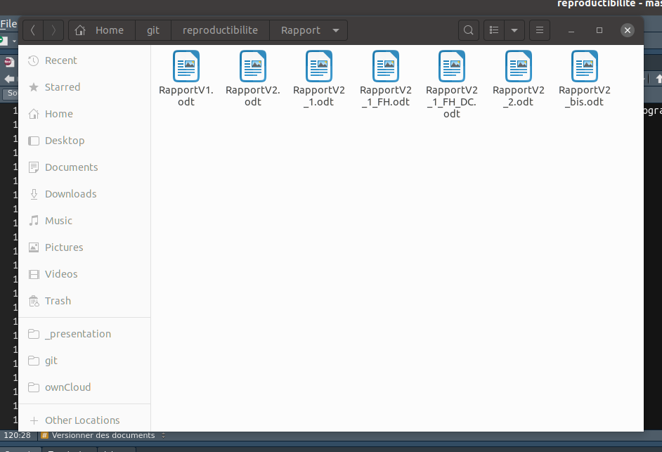</img>
]

---
template: motiv

## La recherche reproductible


 Dans leur [papier](../resources/bes2.1801.pdf) `r Citet(myBib,'alston2021beginner')` font le point sur la question de la recherche reproductible en écologie.
 
 
 Ils identifient des  [Points clé](../resources/bes2.1801_crop.pdf)


Les journaux scientifiques exigent de plus en plus de reproductibilité.


## En pratique

Une [vidéo](https://youtu.be/s3JldKoA0zw) de  [Ignasi Bartomeus](https://bartomeuslab.com/)  vaut mieux qu'un long discours 


--

## Objectif de ce cours 

Initier aux outils pour faciliter l'étape 2.


---

# Vue d'ensemble et panorama d'outils

## Le code 

- .care[git] pour

- garder des traces des différentes versions du code
- pour travailler à plusieurs
- pour relire/amender le code des autres

--


## Autour du code 

- .care[[Rmarkdown](https://rmarkdown.rstudio.com/)] associe  du code R et du texte pour

  * des exemples d'utilisations, 
  * les fichiers d'aide de R, 
  * des articles, 
  * des dashboards ....
  
- Les [Jupyter notebooks](https://jupyter.org/)  permettent la même chose pour différents languages (Python, R, Julia, ...) 

 [Computo](https://computo.sfds.asso.fr/) réclame des contributions sous forme de Jupyter notebook ou Rmarkdown


--

## Figer/Gérer les versions de logiciel utilisés 

Pour assurer la reproductibilité, il ne suffit pas de s'assurer que le code a tourné une fois sur une machine avec succès.  


Le systeme de container [Docker](https://www.docker.com/) permet de figer un environnement sur lequel le programme fonctionne.

---

# Le trio gagnant de la recherche reproductible avec R

- .care[git]
- .care[Rmarkdown]
- Docker


---
name: gitintro
# Introduction à git

---
template: gitintro

## Qu'est ce que git ?

Linus Torvalds: *I'm an egotistical bastard, and I name all my projects after myself. First Linux, now [git](https://www.wordreference.com/enfr/git).*

--

Git est un système de contrôle de version (le plus largement utilisé aujourd'hui). Il permet de suivre l'ensemble des modifications apportées à un code depuis sa création.

Git est très performant.

Git est un peu sauvage, pas simple  à maîtriser.


---
template: gitintro

## Graphiquement, sous forme d'arbre

</img>


Cf example git_example avec la commande

```{r git_illustration, eval = FALSE}
git log
```


---
# Configuration


Le but de git est de garder une trace des différentes versions d'un projet et de leur auteur, il faut donc s'identifier. Dans une console git taper la commande :


## Lors de la premieère utilisation après l'installation

```{r git_config, eval = FALSE}
git config --global user.email "votre adresse mail"
git config --global user.name "votre nom"`
git config -l # pour vérifier
```

---

# Partir de l'existant : cloner un repo distant


* Cloner le dépot qui va nous servir d'example, dans une console git taper la commande :

```{r git_clone, eval = FALSE}
cd # pour se placer dans son repertoire pricipal
ls   #commande qui liste le contenu d'un répertoire
git clone  nomdudepot # commande qui clone effectivement le repot distant
ls # on regarde ce qui est maintenant dans le repo
```

--

* Taper la commande `git log`

* ou un peu plus visuel, `gitk`

---
name: contribute

# Contribuer au code

---
template: contribute

## Faire son premier commit 

* Ouvrir le fichier `manchots.Rmd` et ajouter votre nom et la liste des auteurs et sauvegarder votre fichier . 
--

* Taper la commande `git log` dans la console
--

* Taper la suite de commandes :

```{r status_diff, eval = FALSE}
git status # etat de notre projet
git diff
```

--

* Taper la commande `git add manchots.Rmd`  puis refaire les commandes précédentes

--


* Taper la commande `git commit -m "Ajout d'un auteur"` et à nouveau les commandes pour connaitre l'état du projet.

--

* Dessiner l'arbre des commits

--

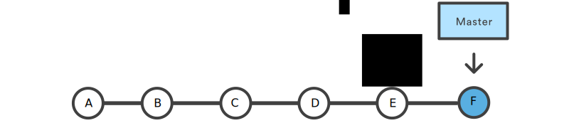</img>


---
template: contirbute

## Vision global du processus

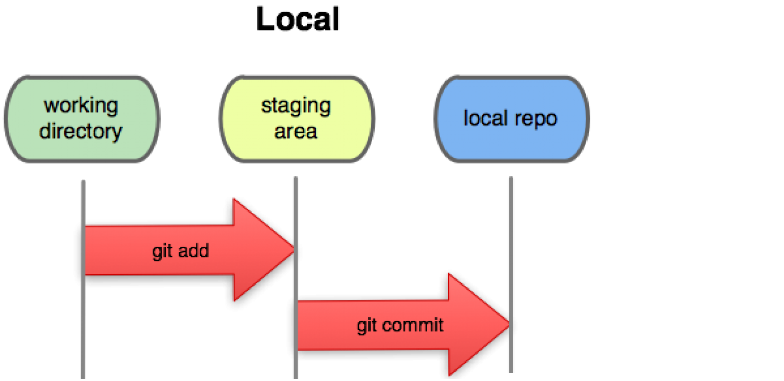</img>

--

### Analogie avec une photo (snapshot)

- Dans le répertoire de travail, on essaie des poses (Working directory)

- Quand est satisfait de la position d'un objet, on lui demande de rester ainsi (Staging area)

- Quand on est satisfait de la position de tous les objets, on prend la photo (local repos)


---
template: contribute

## Travailler à plusieurs : lien avec le repo distant


La version actuelle du projet est donc bien enregistrée dans le système de suivi, mais nous sommes les seuls à le savoir. On peut transmettre ces modifications au repo distant dont nous sommes partis.

Pour voir les différences avec le repo distant `git diff origin/master`.

Pour envoyer nos modifications `git push`.

Le contenu du repo local est poussé sur le serveur. Le repo local et  la copie distante sont-ils identiques  ?

--

`git diff master origin/master`
 

--

* Modifier le fichier `manchots.Rmd`, que va donner la commande  `git diff master origin/master`, pourquoi ? 

* Que va donner la commande `git diff origin/master` ?


---
template: contribute

## Travailler à plusieurs : résumé sous forme d'arbre


* Avant de pousser nos modifications 

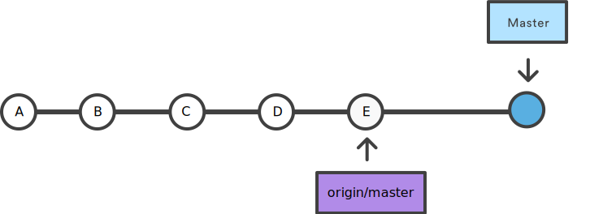</img>

--

* Après avoir poussé  nos modifications 

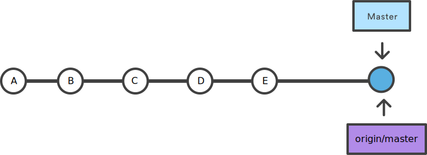</img>


---
template: contribute

## Travailler à plusieurs : vision globale

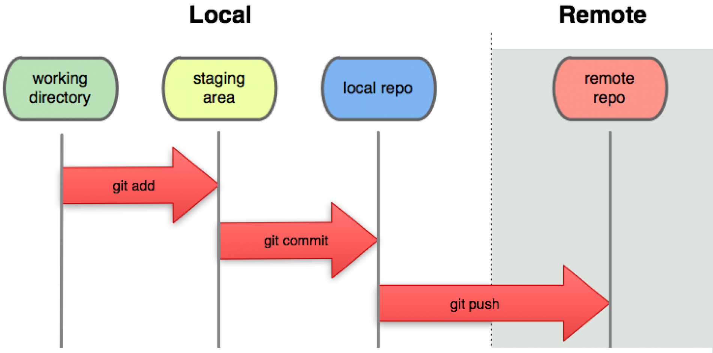</img>

--

### Analogie avec une photo (snapshot)

- Dans le répertoire de travail, on essaie des poses (Working directory)

- Quand est satisfait de la position d'un objet, on lui demande de rester ainsi (Staging area)

- Quand on est satisfait de la position de tous les objets, on prend la photo (local repos)

- On publie la photo pour que tout le monde en profite (remote repo)


---
---
template: contribute

## Travailler à plusieurs : intégrer les modifications des autres

Le repo distant a pu être mis à jour pendant qu'on travaillait sur la version locale. Dans ce cas il faut intégrer les modifications.

```{r git_pull, eval = FALSE }
git pull 
```

--

Si personne n'a modifié la même portion du fichier que vous, git va tranquillement intégrer les modifications des autres dans votres code.


---
template: contribute

## Travailler à plusieurs : merge sous forme d'arbre

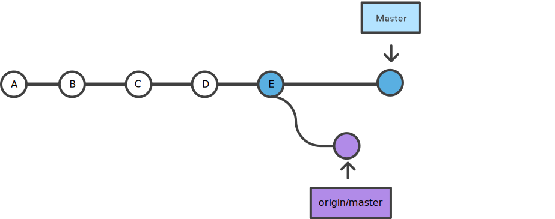</img>


---
template: contribute

## Travailler à plusieurs : merge sous forme d'arbre

Après le merge 

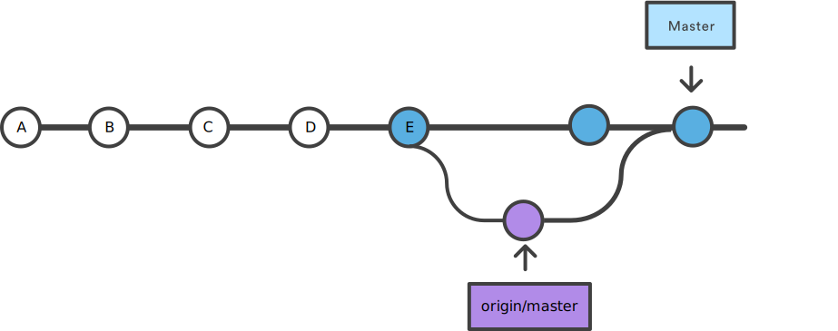</img>


---
template: contribute

## Travailler à plusieurs : merge sous forme d'arbre

Après le push 

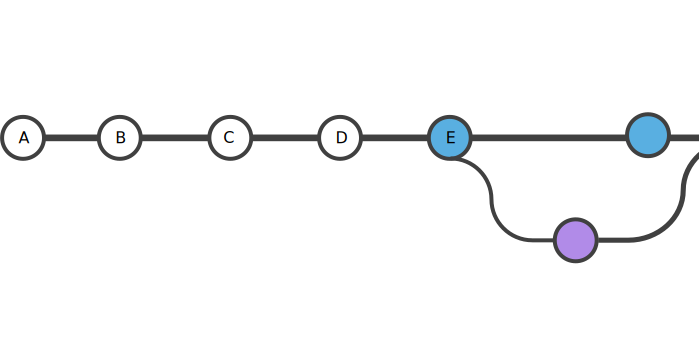</img>

---
template: contribute

## Travailler à plusieurs : gérer les conflits


Si la même portion du fichier a été modifiée sur le serveur, git panique,  c'est le 

--

.care[CONFLIT]


```{r git_conflit, eval = FALSE}
CONFLICT (content): Merge conflict in manchots.Rmd
Automatic merge failed; fix conflicts and then commit the result.
```

--
Il faut résoudre le conflit 

```{r git_conflit_resolve, eval = FALSE}

<<<<<<< HEAD
L'objectif de cette classe est de proposer des représentations graphiques de ces données en collaborant à l'aide de l'outil git. Il faut bien une raison d'utiliser git.
=======
L'objectif de cette classe est de proposer des représentations graphiques de ces données en collaborant à l'aide de l'outil git. C'est un prétexte pour utiliser git.
>>>>>>> conflit
```

On édite le fichier pour choisir la bonne version, puis `git add, commit push`.


** Prendre un moment pour déveloper à deux ou trois et gérer nos conflits **


---
template: contribute

## Travailler à plusieurs : vision globale 

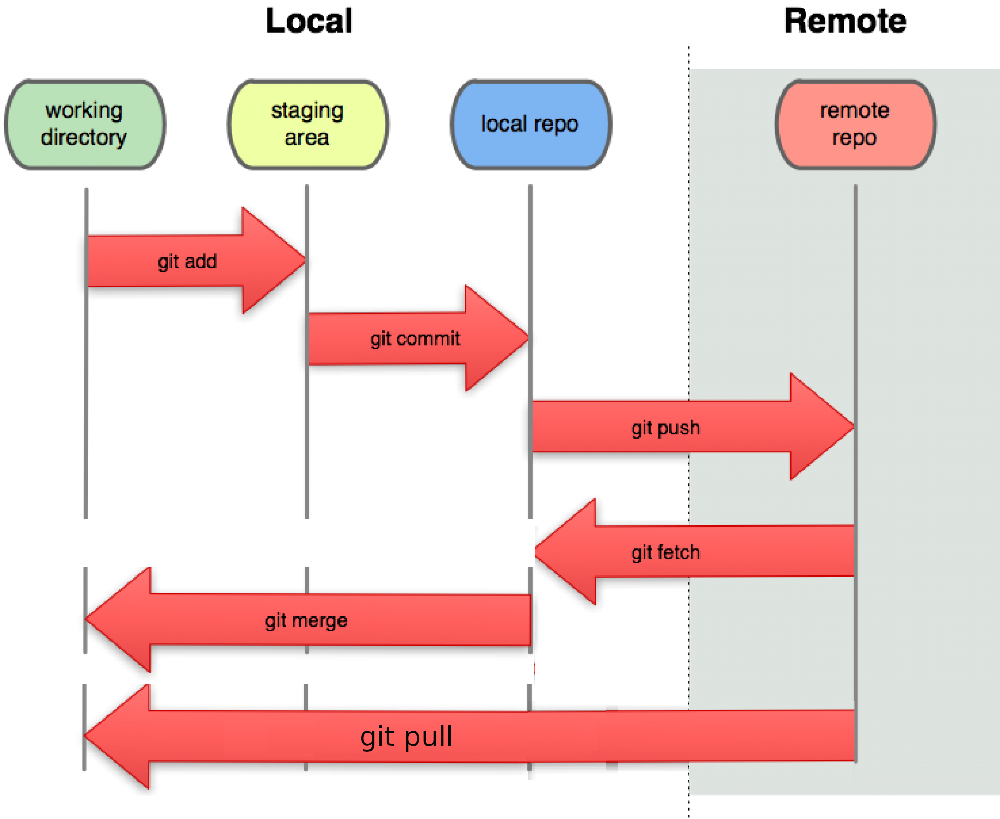</img>


---
template: contribute

## Travailler à plusieurs : sans se gener, les branches

Pour limiter les conflits, pour faire des tests sans géner les autres, il existe la notion de branche.

--

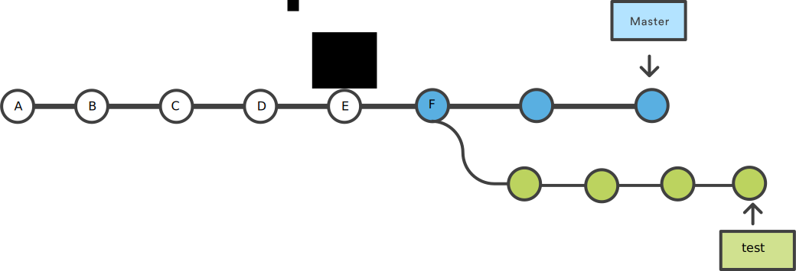</img>


---
template: contribute

## Travailler à plusieurs : les branches en pratique

* Pour créer une branche

```{r git_branch, eval = FALSE }
git branch test
```

* Pour se placer sur cette branche

```{r git_switch, eval = FALSE }
git switch test
```

On peut faire les modifications que l'on veut, les ajouter, les commiter etc mais quand on retournera sur la branche master, on retrouvera notre projet comme on l'a laissé avant de faire ce branchement


---
template: contribute

## Travailler à plusieurs : les branches, illustration

On vérifie qu'on est dans la branche test `git branch` (`git branch -a` pour voir aussi les branches distantes).

La branche dans laquelle on se trouve est décorée d'une étoile.

On switch vers cette branche si besoin.


* Effacer le fichier `manchots.Rmd ` puis prendre en compte  cette modification dans le repo en faisant

```{r illustration_branche, eval = FALSE} 
rm manchots.Rmd # ou l'effacer avec l'explorateur
git status
git add manchots.Rmd # on ajoute les modifications concernant le fichier manchots.Rmd, i.e sa suppression
git commit -m "Suppression du fichier manchots.Rmd"
ls #liste le contenu du répertoire de travail
```

* Retourner vers la branche master `git switch master` et regarder le contenu de votre répertoire de travail. 

--

On peut supprimer cette branche de test inutile avec la commande


```{r delete_branche, eval = FALSE} 
git branch  -d test 
```

--

Les modifications de cette branche n'ont été prises en compte nulle part, on perdra le travail si on supprime la branche, git est inquiet pour nous. 

on lui indique de ne pas s'inquiéter avec -D

```{r delete_branche_force, eval = FALSE} 
git branch  -D test 
```

---
template: contribute

## Travailler à plusieurs : incorporer le travail d'une autre branche,  merge


* Créer une branche `dev` et mettez vous sur cette branche

* Ajouter un joli graphique dans `Manchots.Rmd` puis integrer vos modifications dans le projet sur la branche `dev` 

* Pousser votre travail sur le repo distant (regarder les indications de git sur les options de `git push`) (optionnel pour la suite mais utile en général)

* Mettez vous sur la branche `master` et taper la commande `git merge dev` . Vous avez intégrer les modifications faites dans dev, dans la branche master.

* Dessiner l'arbre des commits dans ce cas


---
name: navigate

# Naviguer entre les versions

---
template: navigate

## Revenir à une version précédente

Si on veut revenir à un état précédent du projet, on utilise la commande checkout

Ourvrir le fichier `manchots.Rmd` et executer

```{r git_checkout, eval = FALSE}
git log --oneline
git checkout a304493
```

La version de travail du fichier manchot est dans l'état du commit `a304493`

On revient à la version actuelle avec 

--

```{r git_checkout_2, eval = FALSE}
git checkout master
```

Rien n'a changé


---
template: navigate

## Supprimer un commit local (pas sur le repo distant)

* Effacer le contenu du fichier `manchots.Rmd`, puis commiter cette modificaion

```{r git_checkout_suppress, eval = FALSE}
git log --oneline
git reset --hard c7687bf
git log --oneline
```

--

Attention cette approche est destructrice, on a perdu la trace de notre commit. Il est dangereux d'utiliser cette approche avec des commits publics, car supprimer un commit peut casser l'arbre des commits.


---
template: navigate

## Supprimer un commit public


* Effacer le contenu du fichier `manchots.Rmd`, puis commiter cette modificaion.

On va supprimer ce commit en appliquant son contraire !

```{r git_checkout_suppress_2, eval = FALSE}
git log --oneline
git revert 9647037
git log --oneline
```

---
template: gitintro

## pour de vrai (ou presque)

Au sein de votre équipe, essayer de produire des graphiques, des analyses sur le jeu de données manchots (peut etre une ACP, ou tout autre analyse qui vous semble pertinente). 

Les bonnes pratiques, on travaille chacun sur une branche et quuand le résultat nous convient on le merge dans master.

Le plus beau graphe de commits, gagne un chokobon !!!


---

# Pour finir

* git est le standard dans l'industrie et la recherche pour la gestion de versions

* pour apprendre git, il faut l'utiliser le plus souvent possible,

* revenir à la documentation régulièrement

* git workflow est une surcouche de git qui impose des bonnes pratiques

* git ne dispense pas d'avoir un code propre (package `formatR`, `styleR` ) et documenter (`roxygen`)


---

# Pour finir

## Des ressources

* [le livre de git](https://git-scm.com/book/en/v2)
* [Atlassian tutorial](https://www.atlassian.com/git/tutorials/what-is-version-control)

## Des aides mémoires

[Git Cheat sheet](https://education.github.com/git-cheat-sheet-education.pdf)

## Références

```{r refs, echo=FALSE, results="asis", eval = TRUE, cache = FALSE}
PrintBibliography(myBib)
```

