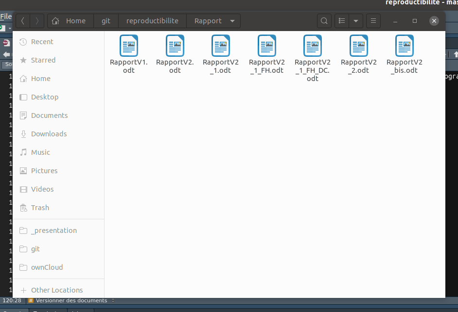

## Motivations

### Reproducible science

In their [paper](resources/bes2.1801.pdf), @alston2021beginner address
the question of science reproducibility in ecology.

The [key aspects](resources/bes2.1801_crop.pdf)

It’s a growing trend: more and more journals require some elements of
reproducibility.

## Motivations

### Practically

Where is the correct version of the report?

{width="600" height="450"}

## Motivations

### Practically

An explanation in images: [vidéo](https://youtu.be/s3JldKoA0zw) by
[Ignasi Bartomeus](https://bartomeuslab.com/).

## Course objective

[Introducing tools to facilitate step 2.]{.h1}

## Overview

### Around the code

[[Rmarkdown](https://rmarkdown.rstudio.com/)]{.care}, [[Jupyter
notebooks](https://jupyter.org/)]{.care},
[[Quarto](https://quarto.org/)]{.care} to bring together code, results,
and analysis. - vignettes in R packages\
- R help pages\
- some scientific papers ([Computo](https://computo.sfds.asso.fr/) asks
for Jupyter/Quarto submissions)\
- dashboards …

### Code / paper writing

- [[git](https://git-scm.com/)]{.care} for
  - keeping track of different versions of code\
  - collective work\
  - reviewing and improving code quality

## Overview

### Controlling software versions

Reproducibility also relies on stabilizing programming/library versions.

The container system [[Docker](https://www.docker.com/)]{.care} allows
freezing a working software environment.

## The winning trio of reproducible research with R

- [Quarto]{.care} markup language\
- [git]{.care} code versionning
- [Docker]{.care} Controlling software version (last 2 sessions with
  Theo Fabien)
